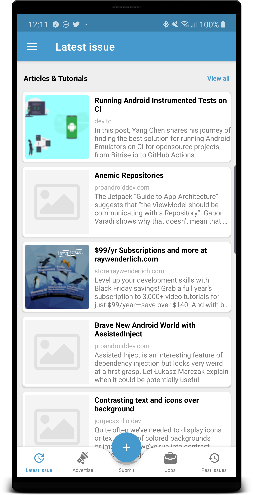
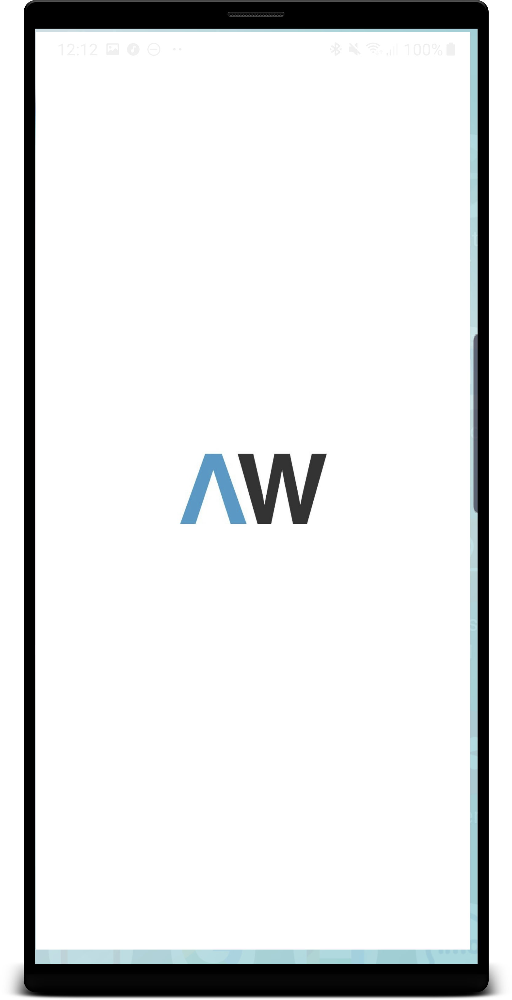

# Android weekly application
Android Weekly is a free newsletter that helps you to stay cutting-edge with your Android Development. The newsletter comes once a week and covers a broad range of topics like tutorials, screencasts, news... just everything that's awesome in the Android Development world!

This project is built on top of multiple libraries and concepts.
- Multi module project.
- Dependency Injection using Dagger 2 **(Needs improvements)**.
- Custom Git hooks for force ktlint style.
- MVVM architecture.
- Kotlin coroutines **(Needs improvements)**.
- Unit test **(Needs improvements)**.
- Room for saving the data on the local database **(Needs improvements)**.
- Using of static analysis tools e.x. detekt.
- Material design for UI/UX **(Needs improvements)**
- AndroidX

# Demo:
  

# Contributing
If you'd like to contribute, please take a look at the issue tracker, For new features, please open an issue to discuss it before beginning implementation.

Use AndroidWeeklyCodeStyle.xml for Android Studio code styles. Check this link for more information about how you can import code style in Android Studio.

Please set your Android studio kotlin code style based on Kotlin Coding Conventions. Check this link for more information about Kotlin Coding Conventions in Android Studio.

# For adding new feature
Please make sure that each new feature should be in a new module with implementing core dependency, so we can change these modules to dynamic-feature in the future if we want.